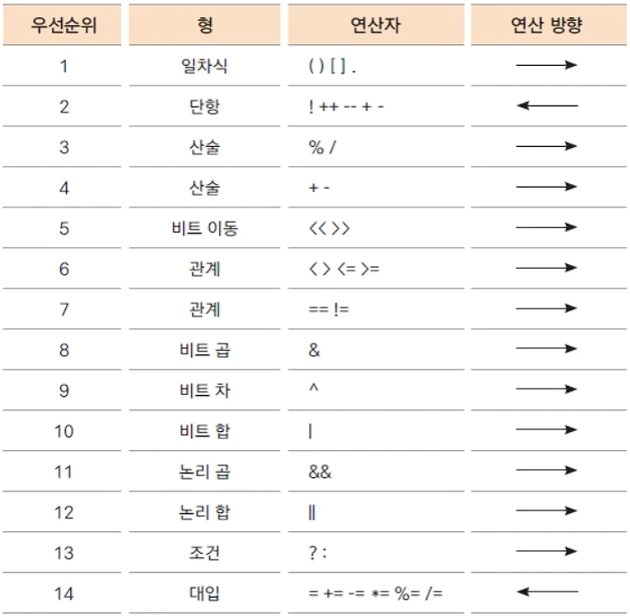

## 자바의 연산자들 -1 
### 대입, 부호, 산술, 복합대입, 증감연산자
#### 항과 연산자
- 항 (operand) : 연산에 사용되는 값
- 연산자 (operator) : 항을 이용해 연산하는 기호.
- 연산자를 항을 위주로 구분해서 보면 단항, 이항, 삼항 연산자로 볼 수 있음. 
- 삼항 연산자 : 조건 연산자
- 대부분은 이항 연산자. 
  - 두개의 + - * / > < 등이 모두 이항 연산자.
  - 두개의 항의 관계에 대해서 나타내는 연산자. 연산이 이루어지는 등.
- 전반적인 우선순위에서 단항 연산자의 그것이 꽤 높음. 대입 연산자는 상당히 낮음. 

#### 대입 연산자(assignment operator)
- 변수에 다른 변수나 값을 대입하는 연산자
  - `int num = 10;` 왼쪽에서 사용된 `=`는 수학에서 사용되는 = 가 아닌 대입 연산자이다.
- 이항 연산자 중 우선순위가 가장 낮은 연산자들
- 왼쪽 변수 = 오른쪽 변수(또는 식, 값)
  - `num = value` 왼쪽에 있는 것은 `lvalue` 오른쪽은 `rvalue`라고 한다.
  - 왼쪽에는 숫자가 올 수 없다. 오른쪽에만 숫자가 올 수 있음. 

#### 부호 연산자
- 단항 연산자
- 변수의 부호를 유지하거나(+) 바꿈(-)
  - int num = 10;           num의 값은 10이다. 
  - system~~println(-num);  - 10이 출력된다. 주의해야할 점은 출력이 -10이 되는 것이지 num이 -10이 되는 것은 아니라는 점. 
- 실제 변수의 부호가 변하려면 대입 연산자를 사용해야함. 
  - `num = -num` 이런 식으로 선언해야 num의 부호가 바뀐다.

#### 산술 연산자
- 사칙 연산자

- `%`는 많이 사용한다. 나머지를 구하는 연산자로, 숫자 n 의 나머지 범위는 0 ~ n-1

#### 복합 대입 연산자
- 대입 연산자와 다른 연산자가 함께 쓰인다.

- 굉장히 편하다! 

#### 증가, 감소 연산자
- 단항 연산자
- 변수의 값을 1 더하거나 뺄 때 사용.
- 연산자가 항의 앞에 있는가, 뒤에 있는가에 따라 연산 시점과 결과가 달라짐.
- 문장(statement) 의 끝(;)을 기준으로 연산 시점을 생각해야한다.
- 부호가 앞에 있으면 문장이 끝나기 전 증가시켜야하고, 뒤에 있으면 문장이 끝난 후 증가시킨다.
- `++` 항의 값에 1을 더함.
  - `val = ++num;` 먼저 num 값이 1 증가한 후 val 변수에 대입.
  - `val = num++;` val 변수에 기존 num 값 대입 후 num 값 1 증가.
- `--` 항의 값에서 1을 뺌.
  - `val = ++num;` 먼저 num 값이 1 감소한 후 val 변수에 대입.
  - `val = num++;` val 변수에 기존 num 값 대입 후 num 값 1 감소.

### 관계, 논리 연산자
#### 관계 연산자
- 이항 연산자.
- 연산의 결과가 true(참), false(거짓)으로 반환. 비교연산자라고도 한다.
- 조건문, 반복문의 조건식으로 많이 사용됨. 

- 제어문의 if 나 while 문에서 많이 사용된다. 

#### 논리 연산자
- 관계 연산자와 혼합하여 많이 사용됨.
- 연산의 결과가 true, false 로 반환.

#### 논리 연산에서 모든 항이 실행되지 않은 경우 - 단락 회로 평가 (short circuit evaluation)
- 논리 곱(&&)은 두 항의 결과가 모두 true 일 때만 결과가 ture
  - 앞의 항의 결과가 false 면 뒤 항의 결과를 평가하지 않음 > 어차피 false 이기 때문.
- 논리 합(||)은 두 항의 결과가 모두 false 일때만 결과가 false
  - 앞의 항의 결과가 true 면 뒤 항의 결과를 평가하지 않음. > 어차피 true 이기 때문. 
- 프로그램을 실행할 때 모든 코드가 다 실행되는 것은 아니다. 

### 조건 연산자, 비트 연산자
#### 조건 연산자
- 삼항 연산자
- 조건식의 결과가 true(참)인 경우와 false(거짓)인 경우에 따라 다른 결과가 수행됨.
- if(조건문)을 간단히 표현할 때 사용할 수 있음.

#### 비트 연산자
- 대입 연산자와 다른 연산자가 함께 쓰임. 
- 마스크 : 특정 비트를 가리고 몇 개의 비트 값만 사용할 때
- 비트 켜기 : 특정 비트들만을 1로 설정해서 사용하고 싶을 때. 
- 비트 끄기 : 특정 비트들만을 0으로 설정해 사용하고 싶을 때. 
- 비트 토글 : 모든 비트들을 0은 1로, 1은 0으로 바꾸고 싶을 때. 

- 어디서 사용하는가? 일반적으로 그리 많이 사용하지는 않지만, 좀 더 빠른 오퍼레이션을 할 필요가 있을 때 비트 연산자를 사용함. 

#### 연산자 우선순위

- 괄호연산자가 전체적으로 높다. 대입 연산자의 우선순위가 낮다. 
- 괄호를 사용해서 가독성을 높이는 것이 좋다. 
- 코딩을 할 때 중요한 것은 가독성! 가독성 좋은 코드를 만들도록 노력하자.