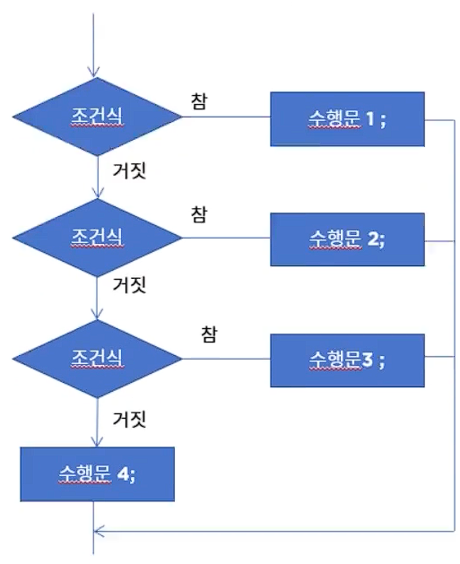

## 조건문
### if 문 (만약에.. 라면)
#### 조건문이란?
- 주어진 조건에 따라 다른 실행이 이루어지도록 구현.
- 만약 `재산이 1억 이상이면 100만원을 세금으로 낸다, 그렇지 않으면 내지 않는다.`를 구현한다면
```
    만약에 (재산이 10억 이상이면) {     // 조건
    세금을 100만원 낸다)               // 수행문
    }
    그렇지 않으면 {
    세금을 내지 않는다.
    }
```
- if문 문법
```
if(조건식){
    수행문;      // 조건식이 '참'인 경우에(조건에 맞는 경우) 수행문이 수행됨 
    }           // 조건식이 '참'이 아니면(조건에 맞지 않는 경우) 수행문이 수행되지 않음.
```
- if-else 문 문법
```
if(조건식){
    수행문1;     // 조건식이 참인 경우 수행됨
} else {
    수행문2;     // 조건식이 참이 아닌 경우 수행됨.
}
```
- if 와 else 는 배타적인 관계
  - 이것, 이라면 저것은 아니고, 저것, 이라면 이것이 아닌 관계

### 조건이 여러개일 때의 if 문
#### if-else if-else 문
- 하나의 상황에 대한 조건이 여러개로 나뉘고, 각 조건에 다른 수행이 이루어져야할 경우 사용
- 각 조건은 상호 배타적으로 프로그래밍되어야 한다.
```
if(조건식1){
    수행문1;           // 조건식 1이 참인 경우 수행하고 전체 조건문 탈출
} else if (조건식2){
    수행문2;           // 조건식 2가 참인 경우 수행하고 전체 조건문 탈출
} else if (조건식3){
    수행문3;           // 조건식 3이 참인 경우 수행하고 전체 조건문 탈출
} else{               // default condition
    수행문4;           // 위 조건이 모두 해당되지 않는 경우 수행(디폴트 조건)
}
수행문5;               // if-else if-else 문이 끝나면 수행됨

가령 조건식 2가 만족될 경우 수행문 2 > 수행문 5 순으로 수행.
```


- 많이 사용된다. 상황에 대해 조건이 하나인 경우는 흔하지 않고, 여러 케이스가 있는 경우가 훨씬 많기 때문.

#### if-else if 문과 if - if 문의 차이점
- if-else if 를 사용하는 경우 하나의 조건이 만족되면 나머지 else if 부분은 수행되지 않음.
- if-if 로 사용하는 경우 각각 다른 조건 문으로 해석되어, 각각 수행하게 된다.
- if는 단독조건.

### 조건이 여러개일 때 간단히 표현되는 switch-case 문
#### switch-case 문
- if-else if-else 문을 사용할 때 복잡하고 번거로운 부분을 가독성 있게 구현할 수 있음.
  - 복잡한 수식이 들어가는 경우도 있지만, 내용이 단순한 경우도 많음.
- 비교 조건이 특정 값이나 문자열인 경우 사용
- break 문을 사용해 각 조건이 만족되면 switch 블럭을 빠져나오도록 구성
- 자바 14부터 좀 더 간결해진 표현식 지원.

#### 문자열 지원되는 switch-case 문
- 문자열도 지원된다.

#### Java 14 부터 지원되는 Switch-case Expression
- 간단하게 쉼표(,)로 조건 구분
- 식으로 표현하여 반환 값을 받을 수 있음. 리턴 값이 없는 경우 오류가 발생.
- 식으로 사용하기 때문에 값을 반환해줄 수 있음. 전에는 switch 문에서 리턴값을 받을 수는 없었다. 하지만, 이제는 리턴 값을 받을 수 있다.
- 화살표 `->`사용. 화살표 뒤 문장이 여러개인 경우 중괄호를 사용해서 표현할 수 있음. 
- `break`를 사용하지 않음.
- 반환값을 주고 싶다면 `yield` 키워드 사용.