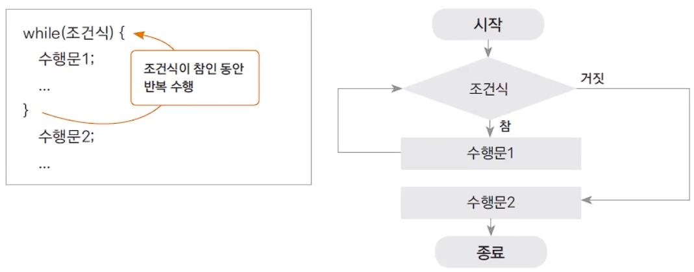
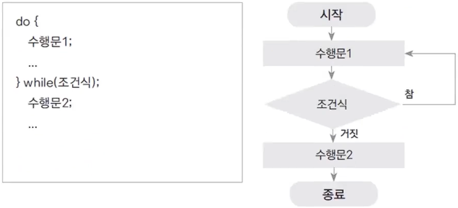
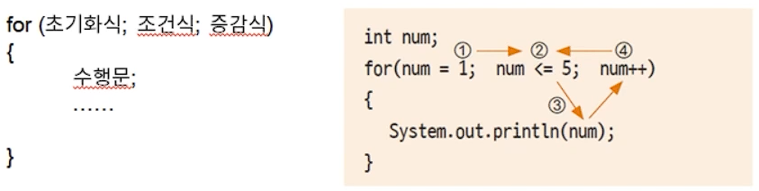
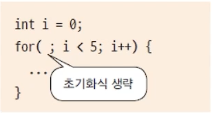
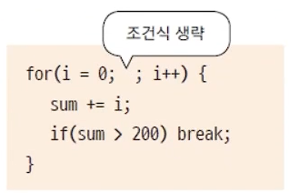
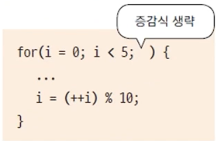
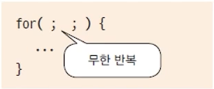

## 반복문
### 반복문 - while 문
#### 조건이 참(true)인 동안 반복수행하기
- 주어진 조건에 맞는 동안(true) 지정된 수행문을 반복적으로 수행하는 제어문. 
- 조건이 맞지 않으면 반복하던 수행을 멈추게 됨.
- 조건은 주로 반복 횟수나 값의 비교의 결과에 따라 true, false 판단 됨.
  - 달리는 자동, 일정 횟수 만큼 돌아가는 나사못, 특저 온도까지 가동되는 에어컨 ...
-------
#### while 문
- 수행문을 수행하기 전 조건을 체크, 조건의 결과가 true 인 동안 반복 수행.

### 반복문 - do-while 문
#### 조건과 상관 없이 한 번은 수행문을 수행
- while 문은 조건을 먼저 체크, 반복 수행이 된다면, do-while 문은 조건과 상관 없이 수행을 한 번 하고나서 조건을 체크.
  - 먼저 수행, do를 빠져나가 조건식을 만족하면 다시 반복 수행. 
  - 무조건 한 번은 수행되고 조건을 체크해야되는 경우 do-while 을 사용한다.
- 조건이 맞지 않으면, true 가 아니면 더 이상 수행하지 않는다.

### 반복문 - for 문
#### for 문의 수행 순서

- 문장이 3개가 들어감. 
- 익숙해지면, 굉장히 실용적이고 편해진다.

for (초기화식; 조건식; 증감식)
{
  수행문;
  ....
}
- 초기화식 : num 을 예시로 하면, `num = 1;` 처럼 초기화를 한다. ; 필수.
- 조건식 : `num <= 5` 따위. num 이 5보다 같거나 작을 때까지.  
- 조건식을 만족하면 수행문의 내용을 수행한다.
- 증감식 : 수행을 하고 나서 증감식을 수행. 조건식의 조건이 맞는지 체크한다. 
- 조건식 → 수행문 → 증감식 → 조건식 → 수행문 ... 삼각 반복을 수행한다.
- 카운팅을 할 때 굉장히 많이 사용한다.

### 각 반복문은 주로 언제 사용할까? 
- while 문 
  - 수행 : 조건이 참인 동안 반복 수행. 조건이 맞지 않으면 수행되는 부분이 없다.
  - 쓰임 : 조건식의 결과나 변수가 true, false 값인 경우 주로 사용.
  - 플래그 값 체크. 
- do-while 문
  - 수행 : 조건이 참인 동안 반복 수행. 수행문을 먼저 수행, 조건을 체크한다.
  - 쓰임 : 조건식의 결과나 변수가 true, false 값인 경우 주로 사용.
- for 문
  - 수행 : 초기화, 조건체크, 증감 순으로 수행
  - 쓰임 : 특정 수의 범위, 횟수와 관련하여 반복되는 경우 주로 사용. 
  - 배열과 함께 많이 사용됨.

#### for 문의 문장에서 생략가능한 것
- 초기화 식 생략 : 이미 이전에 값이 초기화되어 for 내부에서 값을 지정할 필요가 없는 경우.

- `;`은 생략할 수 없다.
- 조건식 생략 : 반복 수행에 대한 조건이 수행문 내부에 있는 경우.

- for 문 안에 조건식이 들어가는 경우가 있는데, 조건을 생략하고 조건문에 의해 제어되도록 할 수 있다.
- 증감식 생략 : 증감식에 대한 연산이 복잡하거나 다른 변수의 연산 결과값에 결정되는 경우.

- 증감식 공간에 너무 복잡한 식이 들어가게 되면 가독성이 떨어지기 때문. 증감식을 바깥으로 뺄 수도 있다.
- 무한 반복

- for 문 안에 문장이 들어가지 않으면 무한반복하게 된다. 
- 서비스를 돌릴 때는 서비스가 계속 살아있어야 한다. 이런 경우 사용할 수 있다.

#### 참고
`i+1` 과 `i++`는 다르다.
i+1 자체는 i 값이 증가하지 않는다. 증가하기 위해서는 대입연산자를 사용해야 함. 
i++ 는 `i = i+1` `i+=1`과 동일한 의미. 따라서 값을 씩 증가시키려 한다면 `i++`를 사용해야한다.

### 중첩 반복문(Nested Loop)
- 반복문 내부에 또 다른 반복문이 있는 경우.
- 여러 겹으로 반복문을 겹쳐서 구현 가능. 단, 수행시간에 문제가 발생할 수 있다.
- 외부 반복문과 내부 반복문 간 변수 값 변화에 유의하며 구현해야 함. 
  - 외부에 변수가 있고 그 변수가 내부에 영향을 미친다면, 어느 순간 그 값이 변하게 되고, 그 값이 다시 초기화돼서 내부 반복문으로 들어가야되는 경우가 있음. 그것을 잊어버리면 로직이 돌지 않는다.

### 중간에 멈추는 break 문, 무시하고 계속 진행하는 continue 문. 
- break : 중간에 멈추게 함.
- continue : 어떤 조건이 맞으면 그 이하의 반복을 수행하지 않고 조건 체크를 하게 됨. 뒤에 많은 반복문이 있더라도 조건이 맞으면 무시하고 다시 조건 체크를 하게 한다.
#### break 문 사용하기
- 감싸고 있는 제어문의 블록을 빠져 나오는 기능(switch 문에서도 사용)
- 반복문에서는 주로 조건문(if)와 같이 사용, 조건에 해당하는 경우 반복 수행을 멈추고 반복문 외부로 수행이 이동한다.
- 여러 반복문이 중첩되어 있는 경우, break 문이 포함되어 있는 반복문만 빠져 나온다.
  - 내부 반복문에 break 가 있다면, 전체를 빠져나오는 것이 아닌 내부 반복문만 빠져나오게 된다.

#### continue 문 사용하기
- 반복문 내부에서 조건문(if)와 같이 사용, 조건이 맞는 경우 (true 면) 이후 반복문 블럭 내부의 다른 수행문들을 수행하지 않음.