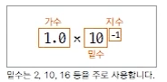

## 프로그램이란?

- 프로그램을 구현한다?
- 프로그래밍 : 프로그래밍 언어를 이용해서 컴퓨터가 일을 수행하도록 만드는 것. 명령어 집합(프로그램)을 만드는 것.
- 컴파일 : 프로그래밍 언어를 컴퓨터가 실행 가능한 기계어로 만드는 일
- 컴파일러 : 기계어로 바꾸어주는 프로그램 (자바 컴파일러, gcc)

## 자바 특징 
- C, C++ : 안정성이 조금 부족함.
### 자바는 휴대용 장치에 사용되는 소프트웨어 언어로써, 안정성이 가장 큰 장점이다.
- 기존의 언어가 갖고 있던, 모호함/불안 요소등을 과감히 제거함으로써 안정성을 확보했다. 
- java는 플랫폼의 영향을 받지 않는다.
  - 일반적인 경우, OS에 따라 실행파일 형식이 다르기때문에 컴파일하는 과정이 필요하다. windows에서 사용하는 실행파일이 linux에서는 사용할 수 없는 경우가 있는 것. 
  - java의 경우 가상머신(JVM)위에서 바이트 코드를 실행하기 때문에 가상머신만 있다면 `.class`파일을 실행할 수 있다. OS에 관계 없이! 
  - VM에 올려서 사용하는 만큼 초기에는 속도가 조금 느렸지만, 지금은 속도 이슈가 없다.
- 자바는 객체지향적이라는 특징이 있다.
- 자바는 풍부한 기능을 갖고 있는 오픈소스. 

### 객체지향 프로그램밍이란?
- 프로그램의 구현을 시간의 흐름순이 아닌, 객체간의 관계와 협력을 기반으로 프로그래밍 하는 것. 
- OOP(Object Oriented Programming)이라고 함. 
- 장점 : 재사용성, 유지보수, 코드관리, 신뢰도 높음

### 프로그래밍 
- 웹 서버 구현
- 안드로이드 프로그래밍
- 게임 프로그래밍

### 첫 자바 프로그램 만들고 실행하기
- 패키지 이름은 소문자
- 패키지 안에 `HelloJava.java`라는 클래스가 생성됨.
- `main` 이라는 함수는 구동을 위한 함수. 항상 사용하지는 않는다. 자바는 일반적으로 웹서버에서 구동되기 때문에, main을 사용하지 않는 경우가 많다.
- 자바에서 컴파일을 하면, `.class`라는 파일이 만들어지고, 그 파일이 실행되게 된다.
- 컴파일된 파일은 `binary`에 가고, 거기에 .class 파일이 있게 된다.

### 컴퓨터에서 자료 표현하기
- 컴퓨터는 2진수밖에 이해하지 못한다. 컴퓨터는 반도체 메모리로 구성되기 때문에 켜졌다, 꺼졌다(0과 1)밖에 인지하지 못한다.
- 2진수와 8진수, 혹은 16진수를 쓰기도 한다. 
- int : 4byte = 32bit

### 변수는 변하는 수
- 변수는 언제 사용하나?
  - 프로그램에서 변하는 값을 나타낼 때.
  - 표현하려는 값에 맞는 데이터 타입(자료형)을 이용해 변수 선언
  - 표현하려는 자료가 숫자, 문자, 문자열 등 다양할 수 있으므로 그에 맞는 자료형 사용
- 중간에 선언해도 되지만, 중간중간 선언해도 된다. 선언과 동시에 초기화 할 수도 있음. 
- 데 이터 타입과 함께 변수를 선언한다. 변수선언은 데이터형에 맞는 메모리 크기를 선언하는 것. 
- 명령 규칙은 매우 프리하지만, 아예 없지는 않다.
  - 변수 이름은 영문자와 숫자를 사용할 수 있고, 특수문자 중 `$` 와 `_` 사용 가능하다.
  - 이름 시작은 숫자로 할 수 없다.
  - 자바에서 이미 사용하고 있는 예약어는 사용할 수 없다.
  - 프로그램 내에서 사용되는 것이므로 용도에 맞고 가독성이 좋게 만드는 것이 중요하다. 
  EX) `int ns;` vs `int numberOfStudent;` 나중에 볼 때 이해하기 좋게끔 가독성 좋게, 이해하기 쉽게 정하는 것이 중요하다. 

### 정수는 프로그램에서 어떻게 표현할까?
- 자료형은 새로 선언해서 사용하지 않지만, 참조 자료형은 새로 선언해서 사용한다.
- 정수와 실수는 사용 메모리가 다르기 때문에 사용하는 종류가 다르다.
- 정수 자료형의 종류와 크기
  - byte
  - short
  - int
  - long
- byte와 short
  - byte : 1바이트 단위의 자료를 다룰 때 사용. 동영상, 음악 파일, 실행 파일의 자료 등을 처리할 때 사용.
  - short : 2바이트 단위의 자료형 C/C++ 언어와 호환시 사용. 많이 사용하지 않음.
- int 
  - 자바에서 사용하는 정수에 대한 기본 자료형
  - 4바이트 단위의 자료형
  - 프로그램에서 사용하는 모든 숫자(리터럴)은 int로 저장됨.
  - 32비트를 초과하는 숫자는 long 자료형으로 처리.
  - 숫자 중 정수는 4byte의 int(Integer)로 잡히게 된다.  
  EX) 10이라는 값을 사용했을 때 이미 10이라는 값은 메모리에 잡혀 있다. 그리고 그 메모리가 4byte이다. 
- long
  - 8바이트 자료형
  - 숫자 뒤에 알파벳 L 또는 l 사용해 long 형임을 표시한다.
  - 예) int num = 123456789; // 오류
  - long lnum = 1235467890;  // 오류 
  - long lnumber = 123456789L;  // ok.
  기본적으로 int로 인식하기 때문에 큰 숫자를 선언할 경우 long 타입의 숫자인 것을 알려줘야한다.
  
### 실수의 표현
부동소수점 방식

- 지수부와 가수부로 표현. 
- 컴퓨터에서는 밑수로 2를 사용. 
- 정규화 : 가수가 밑수보다 작은 한 자리까지 가수로 표현되는 것.
- 컴퓨터에서 밑수가 2이므로 정규화를 하게 되면 가수부분의 첫 번째 자리 숫자는 항상 1.

- float 형과 double 형

부동소수점 방식의 오류.
- 지수부가 0을 표현할 수 없기 때문에 약간의 오차가 발생할 수 있다.
- 하지만 장점이 더 많기 때문에 이 방식을 사용하고 있다.

### 문자의 표현
#### 문자도 정수로 표현한다!
- 어떤 문자를 컴퓨터 내부에서 표현하기 위해 특정 정수 값을 정의한다. 예 : A = 65
- A → 인코딩 → 65. 65 → 디코딩 → A
- 문자세트 : 각 문자를 얼마로 표현할 것인지 코드 값을 모아둔 것을 문자세트(character set)이라고 함.
  - ASKII, euc-kr, 유니코드(utf-8, utf-16)
#### 자바에서의 문자 표현. 
- 자바는 문자를 나타내기 위해 세계 표준인 UNICODE를 사용.
- utf-16 인코딩을 사용한다.(모든 문자를 2바이트로 표시.)
- 문자형 변수 선언과 사용. 
  - 문자를 위한 데이터 타입 `char` ch='A';
    - 문자를 쓸 때는 'A' 작은따옴표를 사용한다. "A" 큰따옴표와 전혀 다르다.
    - 'A'는 2byte짜리 문자. "A"는 문자열.
    - String에서 문자열을 제공한다. String은 A와 \0 이 같이 존재한다.
  - 내부적으로 숫자로 표현되므로 숫자를 넣어도 문자가 출력될 수 있음.
    - 양수만 사용할 수 있고, 음수는 사용할 수 없다.